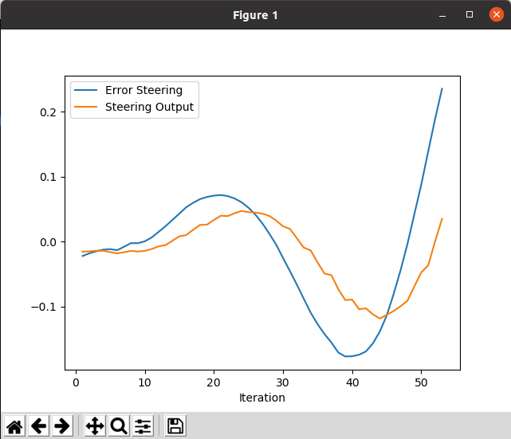
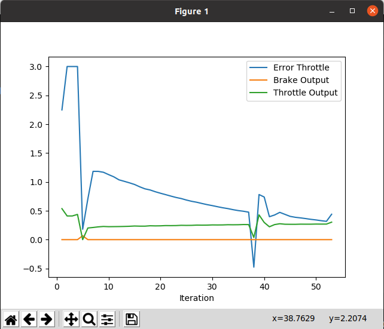

# Control and Trajectory Tracking for Autonomous Vehicle - Analysis Path

In this project, you will apply the skills you have acquired in this course to design a Proportional-Integral-Derivative (PID) controller to perform vehicle trajectory tracking. Given a trajectory as an array of locations, and a simulation environment, you will design and code a PID controller and test its efficiency on the CARLA simulator used in the industry.

## PID Plot
### PID for steering

Regarding steering control, I determine the distance of the last waypoint from the current travel direction. This direction is calculated as a straight line using the current yaw, without considering the front wheel direction, a simplistic approximation that functions in the current simulation. However, it's evident that this approach generates significant error values even for moderate steering due to its oversimplified nature.

### PID for throttle

To regulate throttle, I compute the necessary acceleration from the present speed to reach the final speed based on the given distance. Ideally, I'd prefer to manage the transition between the current and subsequent states, but due to internal inconsistencies, the method works more effectively when aiming for the final state. I experimented with regulating based solely on the required velocity change, but encountered oscillation issues. Instead, using the required acceleration as the input yields a smoother control signal.

## What is the effect of the PID according to the plots, how each part of the PID affects the control command?
In a PID (Proportional-Integral-Derivative) controller, each component plays a distinct role in generating the control command based on the error signal, which is the difference between the desired setpoint and the actual value. The effects of each part can be observed in the plots as follows:
1. Proportional (P) term:
   - This component responds proportionally to the current error. 
   - It directly influences the control output based on the present error. 
   - The P-term alone might lead to steady-state error or oscillations around the setpoint if used individually, as it reacts in proportion to the current error.
   Effect in the plot: A strong P-term will cause the controller to respond quickly to the error, leading to a rapid initial correction. However, it might overshoot the setpoint and result in oscillations.

2. Integral (I) term:
   - The I-term considers accumulated past errors over time.
   - It is responsible for eliminating steady-state error by integrating the error signal.
   - This component responds to the accumulated error over time, correcting any long-term offset between the setpoint and the actual value.
   Effect in the plot: The I-term helps reduce steady-state error over time. If there's a bias or a constant disturbance, the I-term will act to eliminate it and drive the system towards the setpoint.

3. Derivative (D) term:
   - The D-term looks at the rate of change of the error.
   - It anticipates future error by considering the rate at which the error is changing.
   - This component counteracts abrupt changes in the error, damping oscillations and overshoot.
   Effect in the plot: The D-term helps in smoothing out the response. It reduces overshoot and oscillations caused by rapid changes in error, making the system more stable.

In the plots displaying the system's response to a change or disturbance, you can observe how each component affects the control command:
- P: Provides an immediate response to the error but might lead to oscillations or overshoot.
- I: Reduces steady-state error over time and eliminates biases.
- D: Damps oscillations caused by rapid changes in error and helps in stabilizing the system by smoothing out the response.
The combination of these three components in a PID controller is designed to work synergistically to achieve a balance between responsiveness, stability, and steady-state accuracy in controlling the system.

## Design a way to automatically tune the PID parameters
### Implementation Steps

1. Initial Identification: Gather data about the system's response to inputs.
2. Select Method: Choose an appropriate method based on system dynamics, available data, and system complexity.
3. Parameter Adjustment: Apply the chosen method to calculate initial PID parameters.
4. Iterative Refinement: Continuously adjust parameters based on feedback from the system's behavior.
5. Performance Validation: Validate the tuned parameters to ensure they meet desired control objectives.

### Several methods exist for automatic PID tuning

1. Ziegler-Nichols Method:
   Ultimate Gain and Period: In this method, the controller's gain and frequency response are determined by observing the system's response to a step input. The ultimate gain and period are used to calculate initial PID parameters.
2. Cohen-Coon Method:
   Open-Loop Step Response: Similar to Ziegler-Nichols, it uses the open-loop response to calculate parameters. It requires less aggressive step inputs than Ziegler-Nichols and might be more suitable for certain systems.
3. Astrom-Hägglund Method:
   Continuous Cycling Method: This method relies on continuous cycling of the controller in closed-loop, allowing continuous adaptation and refinement of parameters.
4. Model-Based Methods:
   System Identification: Use mathematical models to estimate the system's behavior and derive optimal PID parameters based on these models. Techniques like Least Squares or Kalman Filtering can be employed.
5. Optimization Algorithms:
   Gradient Descent, Genetic Algorithms, or Particle Swarm Optimization: These methods use algorithms to iteratively adjust PID parameters based on the system's response to optimize a defined performance criterion (e.g., minimizing error or overshoot).
6. Fuzzy Logic Control:
   Fuzzy PID: Utilizes fuzzy logic to automatically adjust PID parameters based on linguistic rules and expert knowledge of the system's behavior

Each method has its advantages and limitations based on system characteristics, desired performance, and available data. A combination of these methods or specific tuning for different operational conditions might be necessary for robust control across various scenarios.
For this project i will choice Ziegler-Nichols Method. Because:
- Simplicity: Ziegler-Nichols provides a straightforward approach to tune PID parameters without requiring detailed system models or complex calculations.
- Quick Initial Parameters: It offers a fast way to obtain initial PID parameters by performing tests with the system and observing its response to specific inputs.
- Good Starting Point: It provides a reasonable starting point for tuning PID controllers, enabling engineers to fine-tune parameters based on initial observed behavio.
- Widely Known and Documented: Ziegler-Nichols is a well-established method with ample documentation and historical use across various industries and applications, making it accessible and easy to implement.
- Applicability to Various Systems: While not suitable for all systems, Ziegler-Nichols can be adapted for different types of systems, making it versatile in practice.

## The pros and cons of the type of the PID controller
### Pros:
1. Simplicity and Versatility:
   Ease of Implementation: PID controllers are relatively simple and can be implemented without an accurate model, making them versatile across various systems.
2. Robustness to System Variations:
   Adaptive Control: PID controllers can adapt to changes in the system without requiring explicit knowledge of the system's dynamics, making them robust to variations and disturbances.
3. Real-time Control:
   Immediate Response: PID controllers provide real-time control, reacting to current errors without relying on predictive models, which can be beneficial in dynamic or changing environments.
### Cons:
1. Lack of Accuracy and Optimality:
   Limited Precision: Without a model, PID controllers might not achieve the highest precision or optimal performance, especially in complex systems with nonlinearities or time-varying dynamics.
2. Sensitivity to System Changes:
   Vulnerability to Variations: PID controllers without a model might struggle with sudden or significant changes in system dynamics, leading to suboptimal performance or instability.
3. Difficulty in Fine-tuning:
   Manual Adjustment Required: Tuning PID controllers without a model can be more challenging as it often requires manual adjustments based on empirical observation rather than systematic optimization.
4. Inability to Predict Future Behavior:
   Lack of Predictive Capability: PID controllers don't anticipate future system behavior, potentially causing overshoots, oscillations, or slower responses in rapidly changing systems.

While model-free PID controllers offer simplicity, adaptability, and immediate response, they might lack precision and struggle with complex or rapidly changing systems. Implementing them without a model requires careful tuning and might not achieve the best performance compared to controllers that incorporate system models for predictive control.